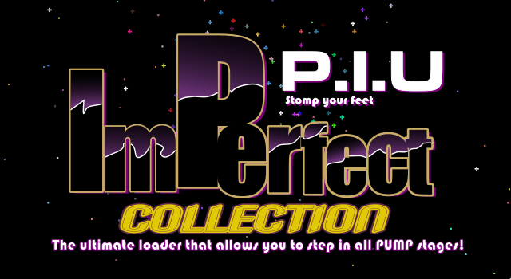

.. Imperfect Collection Documentation & Other documentation master file, created by
   sphinx-quickstart on Fri Jul  4 09:08:49 2025.
   You can adapt this file completely to your liking, but it should at least
   contain the root `toctree` directive.

==========================================
Imperfect Collection & Other Documentation
==========================================

This is the documentation for the Imperfect Collection & other stuff about your
favorite game `Pump It Up`. This documentation will contain everything related
to the system powering the Imperfect Collection, and specifics about the games
and hardware.

Please note that we do not own the game, nor this documentation is endorsed by
the parent company `ANDAMIRO Co. Ltd`. The trademark of `Pump It Up` is property
of `ANDAMIRO Co. Ltd`.

The documentation written here is more of a passion project, with an incentive
to profit from our work not just in money, but in morality or prestige. By that
reasoning, we ask the reader that, if pieces of this documentations are cited
somewhere else, please give the corresponding credits according to the `AUTHORS`
file. The licensing of this documentation is under Creative Commons Attribute
4.0, which its fine-print is included in `LICENSE` file.

.. `reStructuredText <https://www.sphinx-doc.org/en/master/usage/restructuredtext/index.html>`_

.. toctree::
   :maxdepth: 2
   :caption: Contents:

   start/intro
   importer/intro
   games/intro
