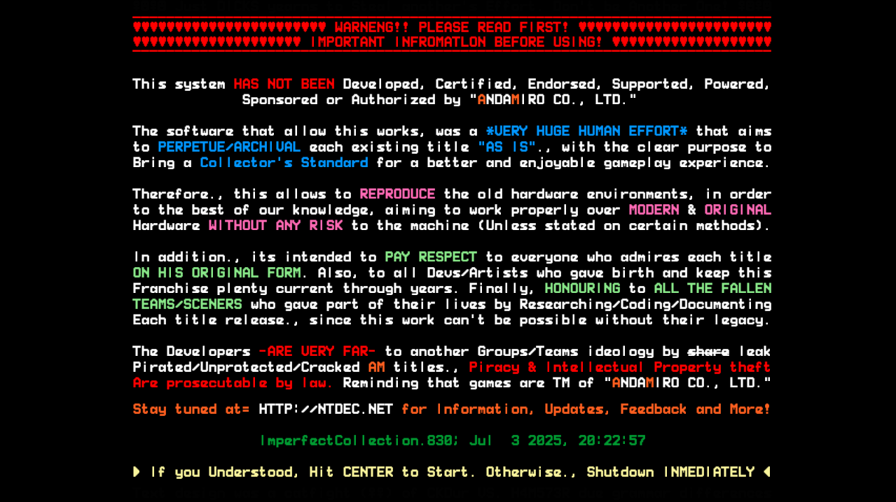
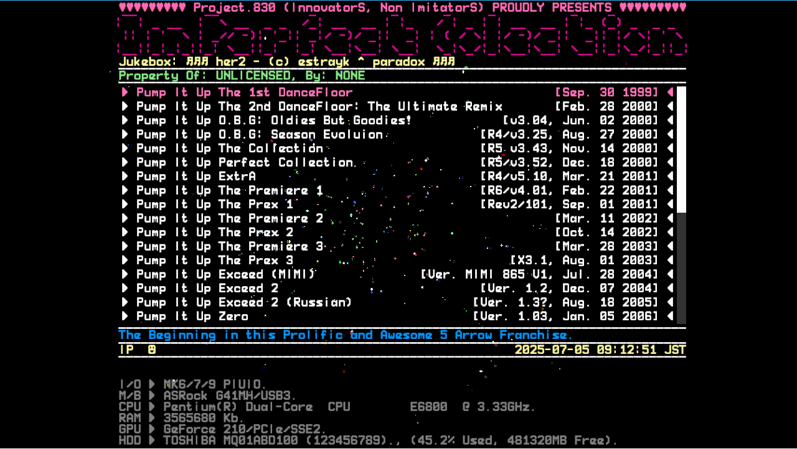
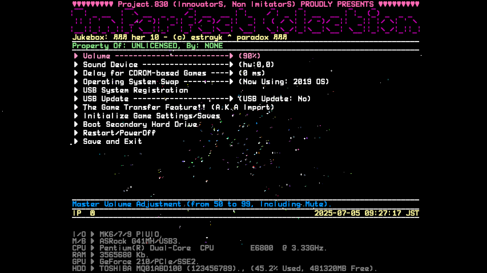

Menu and Navigation (glmenu)
~~~~~~~~~~~~~~~~~~~~~~~~~~~~

After booting the *Imperfect Collection* loader, you will be presented with its 
interface, which includes a **disclaimer screen**, a **game list menu**, and 
intuitive **navigation controls**.

Disclaimer Screen
^^^^^^^^^^^^^^^^^

The first screen you see is a **disclaimer** informing users about the purpose
and legal aspects of this loader. It appears for **10 seconds** before allowing
any input.

To proceed:

- **Press the CENTER button** to agree and continue to the main menu.
- If you do not agree with the disclaimer, **turn off the machine** immediately
  to exit.

This step ensures users understand that *Imperfect Collection* is an archival
and preservation project, not an officially endorsed or licensed product.

Game List Menu
^^^^^^^^^^^^^^

After accepting the disclaimer, you will reach the **game list menu**, which
displays all available Pump It Up titles included in the loader (if installed).

Key features of the game list screen:

- **Game Titles:** Each listed with their version, release date, and special notes where applicable.
- **Navigation Highlight:** The currently selected game is highlighted for clarity.
- **System Information:** At the bottom, hardware information is displayed, including:

  - I/O board detection (MK6/7/9 PIUIO, LXIO V1 or LXIO V2)
  - Motherboard model
  - CPU type and speed
  - RAM amount
  - GPU model
  - Hard disk usage and available space
  - Current system time

Navigation Controls
^^^^^^^^^^^^^^^^^^^

You can navigate the menu using the standard Pump It Up cabinet controls:

- **Move selection up:** Press **UP-LEFT** or **UP-RIGHT**.
- **Move selection down:** Press **DOWN-LEFT** or **DOWN-RIGHT**.
- **Select a game:** Press **CENTER** to launch the highlighted title.
- **Go back or exit:** Press **UP-LEFT** or **UP-RIGHT**.

.. note::

   Navigation can be done also with the FX BUTTON IO, or the front buttons of 
   LXIO. The navigation is parallel, meaning that you can use the same buttons
   for navigating the menu.

Menu Layout Summary
^^^^^^^^^^^^^^^^^^^

The layout of the *Imperfect Collection* menu is designed for clarity and ease
of use:

1. **Header:** Project information and cool banner.
2. **Main List:** Full list of supported games with versions and dates.
3. **Footer:** System hardware status and current date/time for reference.

.. _settings_section:
Settings menu
^^^^^^^^^^^^^

The *Imperfect Collection* loader includes a comprehensive **Settings menu** that allows you to configure various system and loader options to suit your hardware setup and operational needs.

Accessing the Settings Menu
^^^^^^^^^^^^^^^^^^^^^^^^^^^

To access the Settings menu:

1. Press the **Service button** located inside your MK machine. This button is typically used for system-level configuration and maintenance tasks.
2. To exit the Settings menu, either:

   - Select **Save and Exit** from the menu, or  
   - Press the **Service button** again.

Available Settings Options
^^^^^^^^^^^^^^^^^^^^^^^^^^

Below is a detailed explanation of each settings option:

- **Volume**

  Adjusts the master output volume of the system. Available options include:

  - **Mute**
  - **50, 55, 60, 65, 70, 75, 80, 85, 90, 95, and 99%**

  Select the desired level from the submenu to immediately apply it.

- **Sound Device**

  Allows you to select the target sound output device for the loader and **all 
  games run through it**. Devices are displayed in ALSA hardware notation
  (e.g., `hw:0,0`). Ensure you select the correct device to match your cabinet’s
  amplifier setup.

- **Delay for CDROM-based Games**

  Configures the startup delay (in milliseconds) for **any pre-Exceed games** 
  (titles released before Pump It Up Exceed) to ensure proper initialization. 
  The delay range is:

  - **-99 ms to +99 ms**

  Adjust as needed if a game's timing is not accurate enough.

- **Operating System Swap**

  Switches between different OS versions for better compatibility with specific
  MK hardware:

  - **2019 OS:** Recommended for **MK9-v3** and **MK10-v1**
  - **2023 OS:** Recommended for **MK10-v1** and **MK10-v2**

  If you experience issues running games or encounter hardware incompatibilities,
  try switching to the alternate OS. **Note:** Changing the OS will reboot the
  system immediately to apply the change.

- **USB System Registration**

  Used to register your system license via USB. This is required for enabling
  the full functionality of the loader. For detailed instructions, refer to the
  :ref:`licensing_section` section.

- **USB Update**

  Enables updating the loader system via a USB stick containing the update file.
  The status displays:

  - **USB Update: No** – No update file detected  
  - **USB Update: 0** – Update file detected and ready for installation

  For step-by-step update procedures, see the :ref:`updates_section` section.

- **The Game Transfer Feature (A.K.A Import)**

  The main utility for copying games from an original Pump It Up disk to the
  loader system. This tool is essential for building your collection. Due to its
  complexity, detailed instructions are provided in the :ref:`importer_section` section.

- **Initialize Game Settings/Saves**

  Resets save data for individual games:

  1. Upon selecting this option, a list of all available games will appear.
  2. Choose the game whose save data you wish to erase.
  3. Confirm your choice. This action is **irreversible** and will wipe out all
     saved data for the selected title.

- **Boot Secondary Hard Drive**

  Reboots the system from the secondary hard disk connected to your MK. Useful 
  for switching back to an original game disk without physically reconfiguring 
  hardware connections.

- **Restart/PowerOff**

  - **Shut it down completely** the system in the case of regular PCs.
  - **Reboot the system** usually when is an original machine.

- **Save and Exit**

  Saves all current changes and exits back to the main loader menu.

^^^^^

Each of these options plays an important role in configuring and maintaining 
your *Imperfect Collection* environment. In the next sections, we will cover 
:ref:`licensing_section`, :ref:`updates_section`, and :ref:`importer_section` to fully utilize the
loader’s capabilities.
